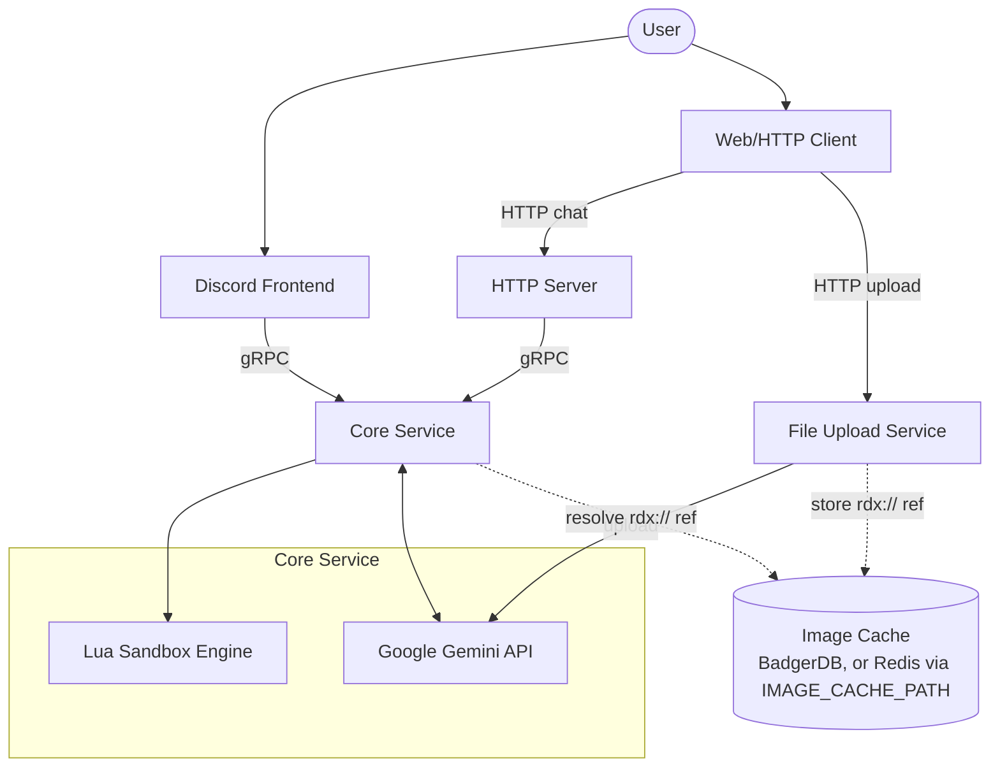

# Magic Conch Shell

[](https://go.dev/)
[](LICENSE)

Magic Conch Shell is a distributed decision-making system built with Go, Google Gemini AI, and a Lua engine. Inspired by the "Magic Conch Shell" from SpongeBob SquarePants, it provides absolute, randomized, and humorous decision suggestions for any user inquiry.

## Core Features

- **AI-Driven Decision Parsing**: Utilizes Google Gemini (Pro/Flash) models to parse user intent rather than providing direct answers.
- **Lua Deterministic Engine**: The AI generates Lua code that executes within a restricted sandbox environment, ensuring decisions are both randomized and logically consistent.
- **Multi-Platform Integration**:
  - **Discord Bot**: Supports text and image inputs with conversation context tracking.
  - **gRPC API**: High-performance backend communication with TLS support.
  - **HTTP API**: Easy integration for Web and other services.
- **Image Analysis**: Supports Discord image attachments, handled automatically via imagecache for downloading, caching, and uploading to Gemini.
- **Flexible Deployment**: Supports both distributed (gRPC) and integrated (monolithic) deployment modes.

## System Architecture



`FileUpload` and `Core` share the same image cache: `FileUpload` uploads an image
to Gemini once and stores an opaque `rdx://` reference to it, `Core` resolves
that reference later instead of re-uploading — see `examples/README.md` for a
full walkthrough of this handoff in a real deployment.

## Directory Structure

- `/core`: Core logic, including AI parser, Lua execution environment, and gRPC server.
- `/discord`: Discord bot frontend implementation.
- `/httpserver`: HTTP API wrapper layer.
- `/fileupload`: HTTP service for uploading images ahead of a chat request (see diagram above).
- `/grpcclient`: Common gRPC client package.
- `/integrated`: Lightweight version integrating core services and frontends into a single process.
- `/examples`: Full Docker Compose deployment (gateway, OAuth2/JWT auth, all services) with its own [README](examples/README.md) and [OpenAPI spec](examples/openapi.yml).

## Quick Start

### Prerequisites

- Go 1.22 or higher
- Google AI (Gemini) API Key
- Discord Bot Token (for Discord bot usage)

### Configuration

Create a `.env` file in the root or module directories:

```env
# AI Settings
LLM_API_KEY=your_gemini_api_key
MODEL_NAME=gemini-1.5-flash
ALLOWED_IMAGE_DOMAINS=cdn.discordapp.com,media.discordapp.net

# gRPC Settings
GRPC_ADDRESS=localhost:50051
# GRPC_TLS_CERT=server.crt
# GRPC_TLS_KEY=server.key
# GRPC_TLS_CA=ca.crt

# Discord Settings
DISCORD_TOKEN=your_discord_bot_token

# HTTP Settings
HTTP_ADDRESS=:8080
```

### Running the Services

#### 1. Start Core Service
```bash
cd core/cmd
go run main.go
```

#### 2. Start Discord Bot
```bash
cd discord/cmd
go run main.go
```

#### 3. Start HTTP Server (Optional)
```bash
cd httpserver/cmd
go run main.go
```

#### 4. Start Integrated Discord Bot (Single Process)
If you prefer to run everything in a single process without setting up a gRPC server, use the integrated version:
```bash
cd integrated/discord/cmd
go run main.go
```

## Usage

### Discord
- **Mention the Bot**: "@MagicConch Should I have ramen or a burger today?"
- **Reply to Conversations**: The bot tracks context to make informed decisions.
- **Image Input**: Send an image and ask "Which outfit should I buy?", and the bot will analyze the content.
- **Slash Commands**:
  - `/q`: Ask the shell a question.
  - `/set-channel`: Set the designated response channel (Administrators only).

### Console Mode (Core)
When the core service starts, you can type questions directly into the terminal for testing.

## Development and Customization

### Custom Decision Logic
Modify `core/assistant/script.lua` to customize Lua function behavior, or adjust `systemInstruction.txt` to refine how the AI generates Lua code.
