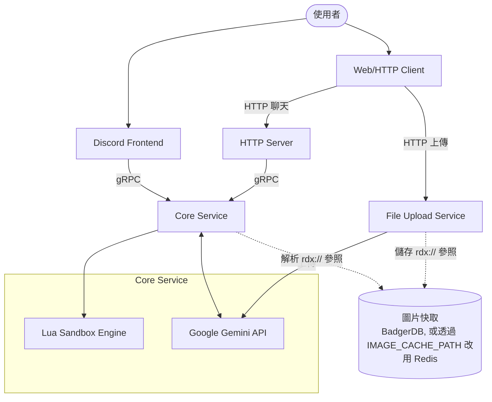

# Magic Conch Shell (神奇海螺)

[](https://go.dev/)
[](LICENSE)

這是一個基於 Go 語言、Google Gemini AI 以及 Lua 引擎開發的分散式決策系統。靈感來自於《海綿寶寶》中的「神奇海螺」，旨在為使用者的任何疑問提供絕對、隨機且有趣的決策建議。

## 核心特色

- **AI 驅動的決策解析**：利用 Google Gemini (Pro/Flash) 模型解析使用者意圖，而非直接回答問題。
- **Lua 確定性引擎**：AI 會生成 Lua 代碼，並在受限的沙盒環境中執行，確保決策過程既具有隨機性又符合邏輯規則。
- **多端整合**：
  - **Discord Bot**：支援文字與圖片輸入，並能追蹤對話上下文。
  - **gRPC API**：高效能的後端通訊，支援 TLS 加密。
  - **HTTP API**：方便 Web 或其他服務整合。
- **圖片分析能力**：支援 Discord 附件圖片分析，透過 imagecache 自動處理圖片下載、快取與 Gemini 上傳。
- **靈活部署**：支援分散式 (gRPC) 或單體式 (Integrated) 部署模式。

## 系統架構



`FileUpload` 與 `Core` 共用同一份圖片快取：`FileUpload` 把圖片上傳到 Gemini 一次
後存下一個不透明的 `rdx://` 參照，之後 `Core` 直接解析這個參照即可，不需重新上
傳——完整的實際部署流程可參考 [`examples/README.md`](examples/README.md)。

## 目錄說明

- `/core`: 核心邏輯，包含 AI 解析器、Lua 執行環境與 gRPC 伺服器。
- `/discord`: Discord 機器人前端實現。
- `/httpserver`: 基於 HTTP 的 API 轉發層。
- `/fileupload`: 在聊天請求之前先上傳圖片用的 HTTP 服務（見上方架構圖）。
- `/grpcclient`: 通用的 gRPC 客戶端封裝。
- `/integrated`: 將核心服務與特定前端（如 Discord）整合在同一個行程中的輕量級版本。
- `/examples`: 完整的 Docker Compose 部署範例（gateway、OAuth2/JWT 認證、所有服務），內含自己的 [README](examples/README.md) 與 [OpenAPI 規格](examples/openapi.yml)。

## 快速開始

### 前置要求

- Go 1.22 或以上版本
- Google AI (Gemini) API Key
- Discord Bot Token (如需使用 Discord 機器人)

### 環境變數配置

在根目錄或各模組目錄下建立 .env 檔案：

```env
# AI 設定
LLM_API_KEY=your_gemini_api_key
MODEL_NAME=gemini-1.5-flash
ALLOWED_IMAGE_DOMAINS=cdn.discordapp.com,media.discordapp.net

# gRPC 設定
GRPC_ADDRESS=localhost:50051
# GRPC_TLS_CERT=server.crt
# GRPC_TLS_KEY=server.key
# GRPC_TLS_CA=ca.crt

# Discord 設定
DISCORD_TOKEN=your_discord_bot_token

# HTTP 設定
HTTP_ADDRESS=:8080
```

### 執行服務

#### 1. 啟動核心服務 (Core)
```bash
cd core/cmd
go run main.go
```

#### 2. 啟動 Discord 機器人 (Discord)
```bash
cd discord/cmd
go run main.go
```

#### 3. 啟動 HTTP 伺服器 (Optional)
```bash
cd httpserver/cmd
go run main.go
```

#### 4. 啟動單體式 Discord 機器人 (單一行程)
如果你希望在單一行程中執行所有功能（不使用 gRPC 伺服器），可以使用整合版本：
```bash
cd integrated/discord/cmd
go run main.go
```

## 使用方法

### Discord
- **直接標記機器人**：@神奇海螺 我今天該吃拉麵還是漢堡？
- **回覆對話**：機器人會追蹤對話上下文來進行決策。
- **圖片輸入**：你可以傳送圖片並問「我該買哪件衣服？」，機器人會分析圖片內容。
- **斜線指令**：
  - `/q`: 向海螺提問。
  - `/set-channel`: 設定機器人主動監聽的頻道（僅限管理員）。

### 終端機模式 (Core Console)
啟動 core 服務後，可以直接在終端機輸入問題進行測試。

## 開發與自定義

### 自定義決策邏輯
你可以修改 core/assistant/script.lua 來自定義 Lua 函數的行為，或修改 systemInstruction.txt 來調整 AI 生成 Lua 代碼的引導語。
